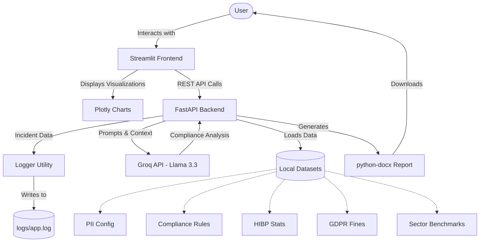

# Web Data Breach Impact Analyser

## Overview
The Web Data Breach Impact Analyser is a comprehensive risk assessment tool designed to evaluate the severity and compliance implications of data breaches. It leverages historical data, industry benchmarks, and advanced language models to provide actionable insights, financial impact estimates, and regulatory obligations for affected organizations.

## Features
- **Risk Assessment**: Calculates a dynamic risk score and severity level based on breached data fields, organizational sector, and affected user count.
- **Regulatory Compliance Analyzer**: Automatically identifies compliance obligations under frameworks such as GDPR and DPDPA, providing specific article and section references.
- **Financial Impact Estimation**: Estimates the minimum, likely, and maximum financial impact using industry cost benchmarks.
- **Historical Breach Intelligence**: Correlates current incidents with historical breach data from HaveIBeenPwned and Privacy Rights Clearinghouse to find similar past breaches.
- **AI-Powered Incident Response**: Generates executive summaries, immediate action plans, and professional breach disclosure letters using the Groq Llama 3.3 model.
- **Automated Report Generation**: Compiles the complete analysis into a formatted DOCX report for stakeholders.
- **Interactive Dashboard**: A comprehensive Streamlit interface featuring risk gauges, compliance timelines, and audit logs.
- **RESTful API Backend**: Fully functional FastAPI backend providing programmatic access to the risk engine and datasets.

## Architecture



- **Frontend**: Streamlit
- **Backend**: FastAPI
- **AI Integration**: Groq API (Llama 3.3 70B Versatile)
- **Data Visualization**: Plotly
- **Document Generation**: python-docx

## Prerequisites
- Python 3.9+
- Groq API Key

## Setup and Installation

1. **Clone the repository:**
   ```bash
   git clone <repository_url>
   cd <repository_name>
   ```

2. **Create a virtual environment (optional but recommended):**
   ```bash
   python -m venv venv
   source venv/bin/activate  # On Windows use: venv\Scripts\activate
   ```

3. **Install dependencies:**
   ```bash
   pip install fastapi uvicorn streamlit pydantic groq python-docx python-dotenv plotly
   ```

4. **Environment Configuration:**
   Create a `.env` file in the root directory and add your Groq API key:
   ```env
   GROQ_API_KEY=your_groq_api_key_here
   ```

## Running the Application

The project consists of two main components that can be run independently or concurrently.

### Starting the API Server (Backend)
```bash
python api.py
```
Alternatively, run via uvicorn directly:
```bash
uvicorn api:app --host 127.0.0.1 --port 8000 --reload
```
The API documentation will be available at `http://127.0.0.1:8000/docs`.

### Starting the Interactive Dashboard (Frontend)
```bash
streamlit run streamlit_app.py
```
The dashboard will open in your default web browser automatically.

## Project Structure
- `api.py`: FastAPI server implementing the risk engine and compliance endpoints.
- `streamlit_app.py`: Interactive user interface and visualization dashboard.
- `logger.py`: Centralized logging utility for system monitoring and audit trails.
- `data/`: Directory containing JSON and CSV datasets for PII configuration, compliance rules, historical breaches, and sector benchmarks.

## License
[Specify License Here]
