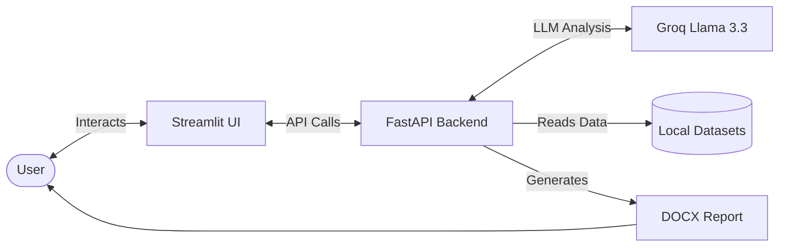

# Web Data Breach Impact Analyser

## Overview
The Web Data Breach Impact Analyser is an advanced, AI-driven risk assessment and compliance tool engineered to evaluate the severity and multifaceted implications of data breaches. Designed for cybersecurity professionals, compliance officers, and incident response teams, this platform provides immediate, actionable intelligence following a breach. 

By cross-referencing breached data against historical cyber incidents and industry-specific financial benchmarks, the Analyser synthesizes risk severity, regulatory exposure, and financial damages into a comprehensive incident report.

## Tech Stack
Our solution leverages a modern, high-performance technology stack to ensure real-time analysis and seamless user experience:

- **Frontend / UI**: [Streamlit](https://streamlit.io/) — Chosen for rapid deployment of interactive, data-rich Python dashboards.
- **Backend API**: [FastAPI](https://fastapi.tiangolo.com/) — A modern, high-performance web framework for building RESTful APIs.
- **Artificial Intelligence**: [Groq Cloud](https://groq.com/) with **Llama 3.3 70B Versatile** — Utilized for ultra-fast, context-aware reasoning to generate executive summaries, compliance analysis, and disclosure letters.
- **Data Visualization**: [Plotly](https://plotly.com/) — Powering interactive gauges, timelines, and analytical charts.
- **Document Generation**: `python-docx` — For compiling automated, stakeholder-ready incident reports.
- **Environment Management**: `python-dotenv` for secure environment variable handling.

## Architecture



## Core Features
1. **Dynamic Risk Engine**: Calculates a precise risk score (1-10) and assigns a severity tier based on the sensitivity of breached Personally Identifiable Information (PII), the organization's sector, and the scale of the breach.
2. **Automated Compliance Mapping (GDPR & DPDPA)**: Instantly identifies regulatory obligations and triggers specific legal articles based on the jurisdiction and the types of data exposed.
3. **Financial Impact Forecasting**: Estimates minimum, highly likely, and maximum financial liabilities using robust industry cost benchmarks (e.g., IBM Cost of a Data Breach Report).
4. **Historical Intelligence Matching**: Correlates the current breach profile with thousands of historical breaches to find patterns, overlapping fields, and similar attack vectors.
5. **AI-Driven Incident Response**: Automatically drafts bespoke, professional breach notification letters and immediate remediation checklists using advanced LLM reasoning.
6. **One-Click Report Generation**: Compiles the entire visual and textual analysis into a structured, downloadable DOCX report for executive stakeholders.

## Data Sources & Intelligence
The engine is powered by a synthesis of multiple authoritative datasets:
- **HaveIBeenPwned (HIBP)**: Historical breach statistics and scale.
- **Privacy Rights Clearinghouse (PRC)**: Past breach scenarios for similarity matching.
- **GDPR Enforcement Tracker**: Precedents for regulatory fines based on specific PII fields.
- **Sector Benchmarks**: Industry-specific financial impact metrics.
- **Local PII Configurations**: Custom weightings and categorizations for sensitive data fields.

## Prerequisites
- **Python**: Version 3.9 or higher.
- **API Key**: A valid [Groq API Key](https://console.groq.com/keys) to power the LLM engine.

## Setup and Installation

1. **Clone the repository:**
   ```bash
   git clone <repository_url>
   cd <repository_name>
   ```

2. **Set up a Virtual Environment (Recommended):**
   ```bash
   python -m venv venv
   # On Windows:
   venv\Scripts\activate
   # On macOS/Linux:
   source venv/bin/activate
   ```

3. **Install Dependencies:**
   ```bash
   pip install fastapi uvicorn streamlit pydantic groq python-docx python-dotenv plotly
   ```

4. **Environment Configuration:**
   Create a `.env` file in the root directory and add your API keys:
   ```env
   GROQ_API_KEY=your_groq_api_key_here
   ```

## Running the Application

This application operates using a decoupled architecture. You must run both the backend API and the frontend dashboard.

### 1. Start the API Server (Backend)
Open a terminal and run the FastAPI server:
```bash
python api.py
```
*(Alternatively, run via uvicorn directly: `uvicorn api:app --host 127.0.0.1 --port 8000 --reload`)*
> The API swagger documentation will be accessible at `http://127.0.0.1:8000/docs`.

### 2. Start the Interactive Dashboard (Frontend)
Open a new terminal window, ensure your virtual environment is activated, and start Streamlit:
```bash
streamlit run streamlit_app.py
```
> The web interface will automatically open in your default browser at `http://localhost:8501`.

## Project Structure
```text
├── api.py                  # Core FastAPI server and risk engine logic
├── streamlit_app.py        # Streamlit frontend, UI components, and visualizations
├── logger.py               # Centralized logging utility and audit trail generator
├── data/                   # Directory containing intelligence datasets
│   ├── compliance_rules.json
│   ├── pii_field_config.json
│   ├── hibp_breaches_full.json
│   ├── gdpr_enforcement_tracker.csv
│   ├── sector_benchmarks.csv
│   └── privacy_rights_clearinghouse.csv
├── .env                    # Environment variables (not tracked in Git)
└── README.md               # Project documentation
```

## License
Specify License Here
